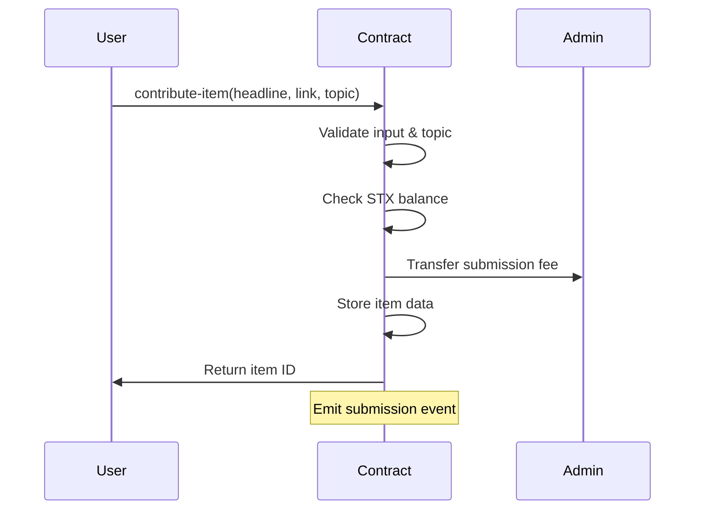
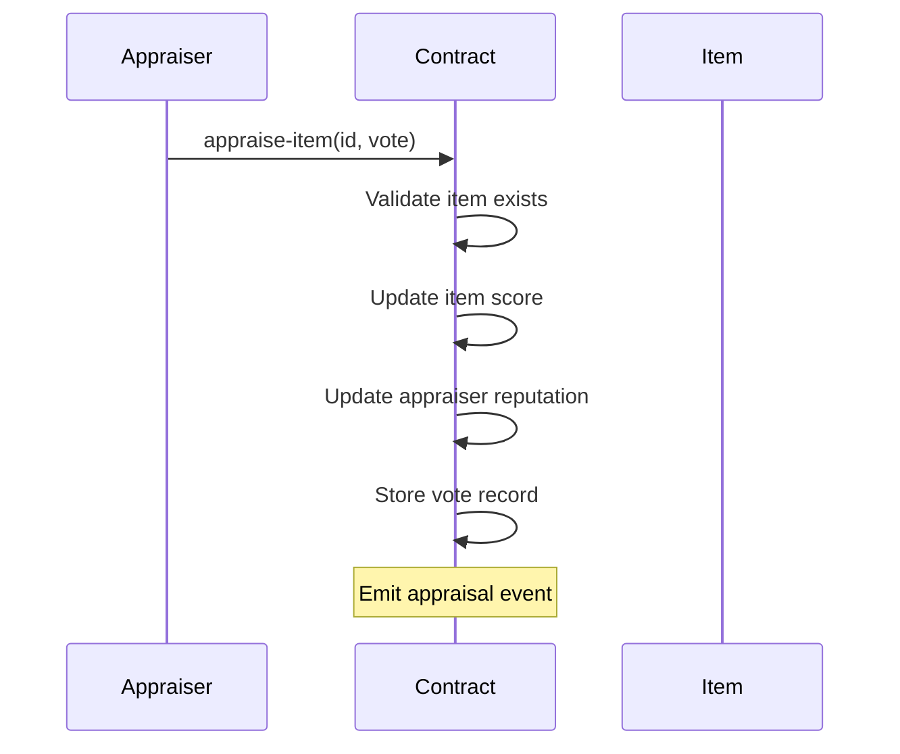

# Curatio - The On-Chain Knowledge Discovery Protocol


## Overview

Curatio is a Bitcoin-anchored protocol built on the Stacks blockchain that transforms community participation into a transparent knowledge marketplace. It enables decentralized submission, validation, and rewarding of high-quality content across multiple domains through a merit-driven ecosystem.

### Key Features

- **Decentralized Content Curation**: Submit and validate content through community consensus
- **Reputation System**: Earn credibility through quality contributions and fair appraisals
- **Incentive Alignment**: STX-based rewards for valuable content and participation
- **Transparent Governance**: Administrator oversight with immutable activity records
- **Flexible Categorization**: Dynamic topic system for evolving knowledge domains
- **Content Moderation**: Community-driven flagging system for quality control

## System Architecture

### Protocol Components

```text
┌─────────────────┐    ┌─────────────────┐    ┌─────────────────┐
│   Contributors  │    │   Appraisers    │    │ Administrator   │
│                 │    │                 │    │                 │
│ • Submit Items  │    │ • Vote on Items │    │ • Manage Topics │
│ • Pay Fees      │    │ • Build Rep.    │    │ • Set Fees      │
│ • Earn Rewards  │    │ • Earn Rep.     │    │ • Moderate      │
└─────────────────┘    └─────────────────┘    └─────────────────┘
         │                       │                       │
         └───────────────────────┼───────────────────────┘
                                 │
                    ┌─────────────────┐
                    │ Curatio Protocol│
                    │                 │
                    │ • Item Storage  │
                    │ • Voting Logic  │
                    │ • Reputation    │
                    │ • Rewards       │
                    └─────────────────┘
```

### Contract Architecture

The Curatio smart contract is organized into several functional modules:

#### Core Data Structures

- **`curated-items`**: Stores submitted content with metadata
- **`participant-appraisals`**: Tracks user votes on specific items
- **`participant-credibility`**: Maintains reputation scores

#### Functional Modules

1. **Content Management**
   - Item submission with fee payment
   - Topic validation and categorization
   - Content flagging mechanism

2. **Voting & Reputation**
   - Binary voting system (+1/-1)
   - Reputation tracking per participant
   - Historical vote tracking

3. **Economic Incentives**
   - STX-based submission fees
   - Direct creator rewards (gratuities)
   - Administrative fee management

4. **Governance**
   - Administrator-only functions
   - Topic management
   - Content moderation

## Data Flow

### Content Submission Flow



### Appraisal & Reputation Flow



## Smart Contract Functions

### Public Functions

#### Content Operations

- `contribute-item(headline, hyperlink, topic)` - Submit new content
- `appraise-item(item-identifier, appraisal)` - Vote on content (+1/-1)
- `reward-originator(item-identifier, amount)` - Send STX rewards to creators
- `flag-item(item-identifier)` - Flag inappropriate content

#### Administrative Operations

- `adjust-submission-charge(new-charge)` - Update submission fees
- `expunge-item(item-identifier)` - Remove content (admin only)
- `introduce-topic(new-topic)` - Add new content categories

### Read-Only Functions

- `retrieve-item-details(item-identifier)` - Get item information
- `retrieve-participant-appraisal(participant, item-identifier)` - Get user's vote
- `retrieve-aggregate-submissions()` - Get total submission count
- `retrieve-participant-credibility(participant)` - Get reputation score
- `retrieve-top-items(limit)` - Get highly-rated content

## Error Codes

| Code | Constant | Description |
|------|----------|-------------|
| 100 | `ERR_UNAUTHORIZED_ACCESS` | Admin-only function called by non-admin |
| 101 | `ERR_INVALID_SUBMISSION` | Invalid content submission parameters |
| 102 | `ERR_DUPLICATE_ENTRY` | Duplicate submission detected |
| 103 | `ERR_NONEXISTENT_ITEM` | Referenced item does not exist |
| 104 | `ERR_INADEQUATE_BALANCE` | Insufficient STX balance |
| 105 | `ERR_INVALID_TOPIC` | Invalid or non-existent topic |
| 106 | `ERR_INVALID_FLAG` | Invalid flagging operation |
| 107 | `ERR_OVERFLOW` | Numeric overflow detected |
| 108 | `ERR_INVALID_APPRAISAL` | Invalid vote value (must be ±1) |
| 109 | `ERR_INVALID_ITEM_ID` | Invalid item identifier |

## Getting Started

### Prerequisites

- [Clarinet](https://github.com/hirosystems/clarinet) for local development
- Node.js and npm for testing
- Stacks wallet for interaction

### Installation

1. Clone the repository:

```bash
git clone <repository-url>
cd curatio
```

2. Install dependencies:

```bash
npm install
```

3. Run tests:

```bash
npm test
```

4. Check contract syntax:

```bash
clarinet check
```

### Development Workflow

1. **Local Testing**: Use Clarinet's local environment for development
2. **Unit Tests**: Run comprehensive test suite with Vitest
3. **Integration Testing**: Test on Stacks testnet
4. **Deployment**: Deploy to Stacks mainnet

## Testing

The project includes comprehensive test coverage using Vitest and Clarinet SDK:

```bash
# Run all tests
npm test

# Run tests with coverage
npm run test:report

# Watch mode for development
npm run test:watch
```

## Configuration

### Network Settings

- **Devnet**: Local development configuration
- **Testnet**: Public testnet for staging
- **Mainnet**: Production deployment

### Protocol Parameters

- **Minimum Link Length**: 10 characters
- **Default Submission Fee**: 10 µSTX
- **Maximum Topics**: 10 categories
- **Default Topics**: Technology, Science, Art, Politics, Sports

## Contributing

1. Fork the repository
2. Create a feature branch
3. Implement changes with tests
4. Submit a pull request

### Code Standards

- Follow Clarity best practices
- Include comprehensive test coverage
- Document all public functions
- Use descriptive variable names

## Security Considerations

- **Access Control**: Administrator functions are properly protected
- **Input Validation**: All user inputs are validated
- **Overflow Protection**: Numeric operations include overflow checks
- **State Consistency**: Atomic operations prevent partial state updates

## License

This project is licensed under the ISC License.

## Support

For questions, issues, or contributions, please:

- Open an issue on GitHub
- Review existing documentation
- Check the test suite for usage examples
